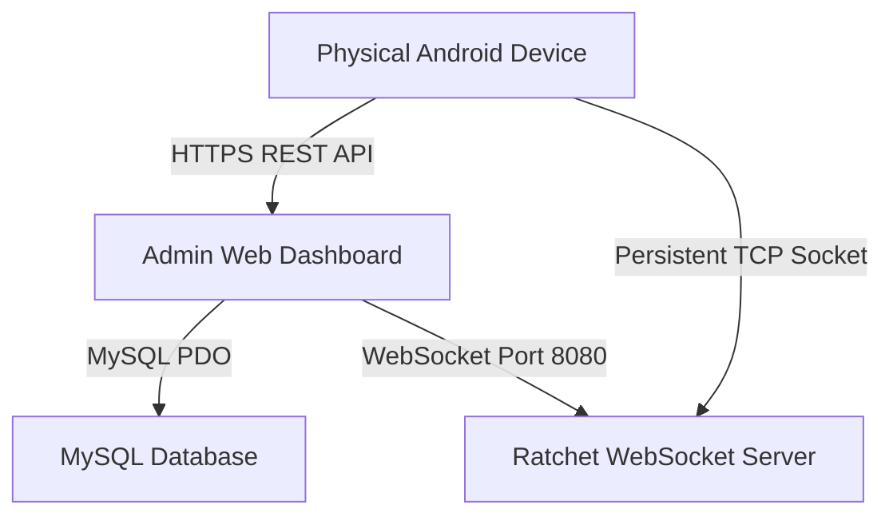
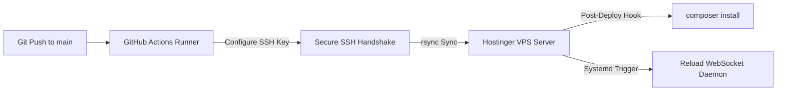

# Enterprise MDM Control Center — Development & Setup Guide

This guide details the technology stack, local development setup, compilation workflows, and the automated CI/CD pipeline for the Enterprise Mobile Device Management (MDM) and Secure Chat platform.

---

## 🛠️ Technology Stack

The platform is designed as an end-to-end, ultra-secure containerized deployment consisting of a control dashboard, real-time message brokers, and Android enterprise clients.



### 1. Control Center Dashboard (Backend)
* **Core Runtime:** PHP 8.2+
* **Database Interface:** MySQL via PDO (relational architecture)
* **Web Server:** Apache 2.4 (utilizes `rewrite` and `headers` modules for relative routing and security CORS headers)
* **Package Manager:** Composer (manages third-party Ratchet WebSocket packages)

### 2. Real-Time WebSocket Engine
* **Runtime:** PHP CLI background service
* **Framework:** Ratchet (built on ReactPHP event loop)
* **Execution Daemon:** standard `systemd` unit supervisor on Ubuntu (`mdm-websocket.service`)

### 3. Android Enterprise Clients
* **MDM DPC Agent:** Native Kotlin (uses Google's Android Enterprise `DevicePolicyManager` API)
* **Secure Chat Client:** Native Kotlin (Retrofit REST client + persistent WebSocket networking)

---

## 💻 Local Development Setup

To replicate this full-stack environment on your local machine (macOS/Windows/Linux):

### 1. Local Web & Database Server
1. Install **XAMPP** or **MAMP** supporting PHP 8.2+.
2. Move the project folder into your root web server directory (e.g., `/Applications/XAMPP/xamppfiles/htdocs/mdm/`).
3. Start the Apache and MySQL modules in your server control panel.

### 2. Environment Configurations
Duplicate the provided [.env.example](file:///.env.example) file to create a local [.env](file:///.env) file:
```ini
DB_HOST=localhost
DB_NAME=mdm_db
DB_USER=mdm_admin
DB_PASS=mdm_secure_pass_2026
APP_URL=http://localhost/mdm
FCM_SERVER_KEY=your-firebase-fcm-v1-server-key-here
```

### 3. Import Schema
1. Open **phpMyAdmin** or your preferred database client (e.g., TablePlus, DBeaver).
2. Create a database called `mdm_db`.
3. Import the [sql/schema.sql](file:///sql/schema.sql) file.
4. Set up an administrator user inside your MySQL instance with the credentials listed in your `.env`.

---

## 📱 Compiling Android Binaries

The repository contains two Android Studio Gradle projects inside the `android/` directory:
1. **`android/mdm-agent/`** (Enterprise MDM DPC controller)
2. **`android/chat-app/`** (Secure Chat client)

### Building the APKs (Android Studio / CLI)

To compile signed production-ready APKs, make sure your keystore configuration properties are set up inside `android/keystore.properties`:

```properties
storeFile=../keystore/mdm.jks
storePassword=mdm_keystore_pass_2026
keyAlias=mdm_key
keyPassword=mdm_key_pass_2026
```

#### Via Command Line (macOS / Linux):
Navigate into the respective project directory and run the Gradle assembler:
```bash
# Compile DPC Agent APK
cd android/mdm-agent
./gradlew assembleRelease

# Compile Secure Chat APK
cd ../chat-app
./gradlew assembleRelease
```
The compiled APK binaries will output to:
* `android/mdm-agent/app/build/outputs/apk/release/app-release.apk`
* `android/chat-app/app/build/outputs/apk/release/app-release.apk`

Copy these compiled files into your server's public asset path so devices can pull them during onboarding:
```bash
cp android/mdm-agent/app/build/outputs/apk/release/app-release.apk apk/mdm-agent.apk
cp android/chat-app/app/build/outputs/apk/release/app-release.apk apk/chat-app.apk
```

---

## 🚀 Auto-Deployment Pipeline (CI/CD)

The platform is configured with an automated production-ready **GitHub Actions CI/CD workflow** inside [.github/workflows/deploy.yml](file:///.github/workflows/deploy.yml).



### 🔑 GitHub Action Secrets Configuration
To enable automatic deployments to your production server on every code push, navigate to your GitHub Repository **Settings > Secrets and variables > Actions** and register these three credentials:

1. **`VPS_HOST`**: The IP address of your production server (`187.77.118.52`).
2. **`VPS_USERNAME`**: The remote login username (`root`).
3. **`SSH_PRIVATE_KEY`**: The raw, unformatted contents of your private SSH key (`~/.ssh/id_rsa`). The pipeline automatically cleans line endings using `tr` to bypass web browser copy-paste errors.

### 🛡️ Production Safe Guards
* **Rsync Isolation:** The sync engine uses targeted `--exclude` commands protecting critical state files from deletion (e.g., your remote `.env` credentials, device log files, and uploaded user avatar binaries are strictly preserved between updates).
* **Systemd Supervisor:** Upon successful sync, the pipeline invokes an SSH hook to install composer dependencies, verify system writable file permissions (`chown -R www-data:www-data`), and hot-reload your persistent WebSocket daemon service on port `8080`.
