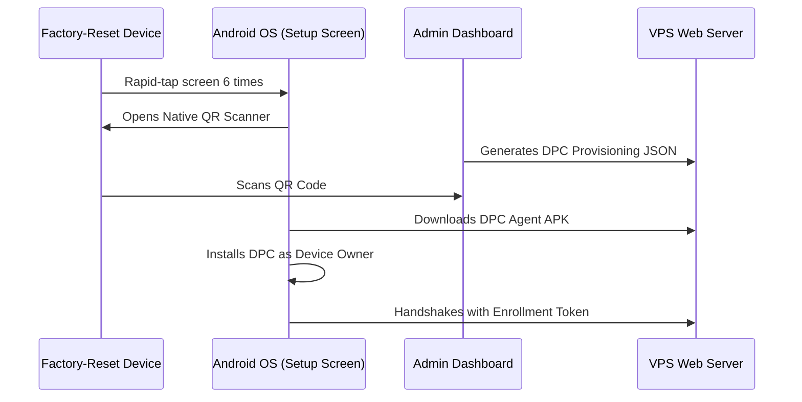
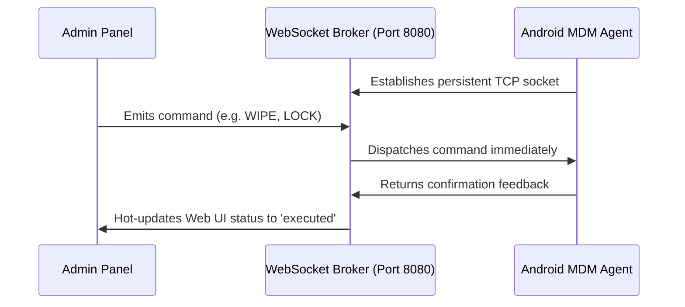

# Enterprise MDM Control Center — How It Works (Architecture & Data Flows)

This guide documents the runtime mechanisms, security restrictions, real-time networking engine, and database relationships that govern the Enterprise Mobile Device Management (MDM) and Secure Chat platform.

---

## 🛰️ 1. Android Enterprise DPC Provisioning Flow

Instead of manual installation, the DPC Agent is established at the operating system root level using Android's native enterprise setup handshake.



### QR Provisioning Payload Structure
When the administrator generates a token on the portal, it constructs a standard Google Enterprise Device Admin configuration bundle:
```json
{
  "android.app.extra.PROVISIONING_DEVICE_ADMIN_COMPONENT_NAME": "com.mdm.agent/com.mdm.agent.DeviceAdminReceiver",
  "android.app.extra.PROVISIONING_DEVICE_ADMIN_PACKAGE_DOWNLOAD_LOCATION": "http://187.77.118.52/apk/mdm-agent.apk",
  "android.app.extra.PROVISIONING_DEVICE_ADMIN_SIGNATURE_CHECKSUM": "",
  "android.app.extra.PROVISIONING_LEAVE_ALL_SYSTEM_APPS_ENABLED": false,
  "android.app.extra.PROVISIONING_ADMIN_EXTRAS_BUNDLE": {
    "enrollment_token": "YOUR_GENERATED_UUID_TOKEN",
    "server_url": "http://187.77.118.52"
  }
}
```

### The 6-Tap Operating System Takeover
1. **Welcome Screen State:** The device must be brand new or freshly factory-reset.
2. **Hidden Scanner Activation:** Tapping the screen 6 times anywhere on the blank setup screen instructs the Android OS kernel to bypass standard user setup, trigger the camera, and wait for an Enterprise configuration scan.
3. **Automatic Takeover:** Once scanned, Android automatically downloads the DPC agent, promotes it to `Device Owner` status (meaning it **cannot be uninstalled or killed** by the user), and hands over execution.

---

## ⚡ 2. Real-Time WebSockets Engine

To achieve absolute real-time device control (without waiting for long-poll delays or heavy battery drain), we implement an asynchronous TCP WebSocket loop on port `8080`.



* **Event Broker:** PHP Ratchet listens persistently on port `8080`.
* **State Retention:** When the Android MDM Agent boots, it opens a persistent WebSocket connection, registering its unique IMEI signature.
* **Instant Command Execution:** When the administrator clicks **Lock**, **Wipe**, or **Ring** on the control panel, the dashboard communicates instantly with port `8080`, and the socket server forwards the command package straight to the active phone connection within milliseconds.
* **Fault-Tolerant Heartbeats:** If the socket drops due to cellular network switching, the background `HeartbeatService.kt` automatically polls every 60 seconds via standard HTTPS REST calls to fetch pending commands and heal the TCP socket.

---

## 🛡️ 3. Security & Kiosk Restriction Model

Once set as Device Owner, our `PolicyManager.kt` enforces iron-clad hardware security policies:

* **Kiosk Mode Pinning:** Uses `setLockTaskPackages()` to lock the screen to *only* the Secure Chat application (`com.mdm.chat`). Home and back buttons are structurally disabled, locking the user out of the rest of the OS.
* **Blocked System Controls:** Standard system capabilities (e.g., factory reset via settings, Developer options, Google account creation, adding additional user profiles) are fully blocked via Android's `UserManager` restrictions.
* **File Theft Mitigation:** USB file transfer capabilities (`DISALLOW_USB_FILE_TRANSFER`) are blocked to prevent data exfiltration.

---

## 💬 4. Secure Chat Onboarding & Challenge Model

To prevent unauthorized access to communication channels, we use a two-step secure onboarding system:

1. **Security Handshake:** When initiating a new chat conversation, a cryptographic security challenge is attached.
2. **Interactive Decryption:** Before the recipient can view or send messages, the Secure Chat app prompts them with the custom security challenge. Successful verification unlocks the persistent conversation key on the client.

---

## 🗄️ 5. Database Schema Relationships

The MySQL database schema is structured for optimized relation queries, security logs auditing, and DPC states reporting:

* **`admins`**: Control portal credentials (super_admins, admins, viewers) with cryptographically salted passwords.
* **`policies`**: Hardware profile definitions (camera blocks, kiosk switches, factory reset locks).
* **`devices`**: Enrolled physical devices storing live status reports (IMEI, battery levels, online states, active policy).
* **`device_commands`**: Execution logs tracking administrative commands (lock, wipe, ring) with detailed timestamps and execution states (`pending`, `sent`, `executed`, `failed`).
* **`conversations` & `messages`**: Multi-tiered secure messaging metadata.
